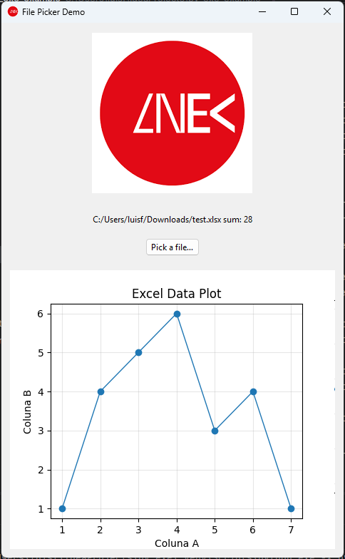

# py_exe_example
Criar um executável **python** com **pandas**, **mathplot**, **tkinter** para ler ficheiros XLSX



## Pacotes de python

### Variáveis de ambiente
Colocar na variavel PATH, o caminho onde o python esta instalado e os scripts
```
C:\Users\EXEMPLO\AppData\Local\Python\bin
C:\Users\EXEMPLO\AppData\Local\Python\pythoncore-3.14-64\Scripts
```

### Instalar pip
```
py -m ensurepip --upgrade
python -m pip --version
```

### Instalar pacotes
```
python -m pip install pandas openpyxl pyinstaller matplotlib
```

### Criar executável
```
python -m PyInstaller main.py --onefile --windowed --icon=res\lnec.ico --name exemplo
copy dist\exemplo.exe .\
```